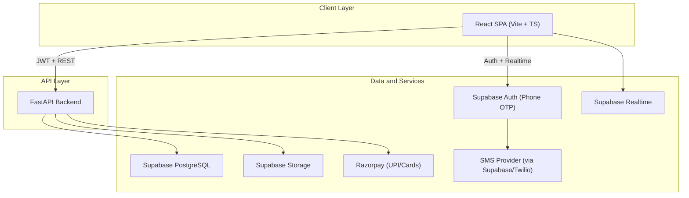
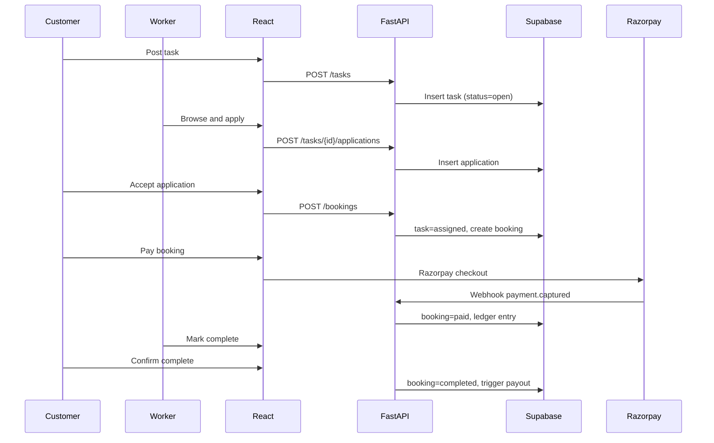
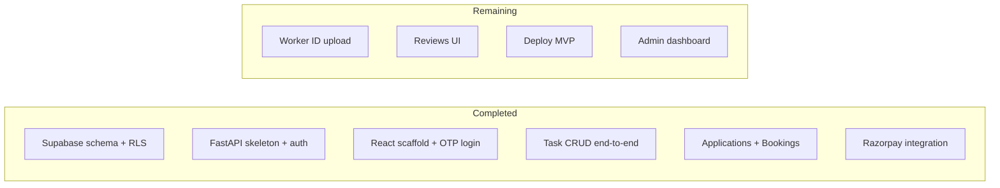

# GigWork Platform Architecture Plan

> Greenfield architecture for a gig-worker marketplace (Urban Company / TaskRabbit style) where customers post tasks and workers apply. React frontend, FastAPI backend, Supabase as DB/auth/realtime, Razorpay for India payments with platform convenience fee.

## Product Vision

A two-sided marketplace connecting **customers** who need small local help (cleaning, moving, kitchen help, errands, basic house management) with **gig workers** who browse tasks and apply. MVP follows a **post-and-apply** model (not instant Rapido-style dispatch). Platform earns a **convenience fee** on each completed booking.

**Out of MVP (Phase 2+):** on-demand geo-matching, companion/dating categories (separate compliance), recurring subscriptions.

---

## High-Level Architecture



**Auth flow:** React uses Supabase client for phone OTP login. Every FastAPI request carries `Authorization: Bearer <supabase_jwt>`. FastAPI verifies JWT with Supabase JWKS and enforces role-based access.

**Why FastAPI + Supabase (not Supabase-only):** payment webhooks, fee calculation, admin logic, future matching algorithms, and audit trails stay in Python; Supabase handles data, RLS, realtime, and file storage.

---

## User Roles and Core Flows

| Role | MVP Capabilities |
|------|------------------|
| **Customer** | OTP signup, post task, review applications, accept worker, pay via Razorpay, rate worker |
| **Worker** | OTP signup + profile onboarding, browse/filter tasks, apply with quote, complete job, receive payout |
| **Admin** | Manage categories, verify workers, set platform fee %, handle disputes |



---

## Repository Structure (Monorepo)

```
GigWork/
├── frontend/                 # React + Vite + TypeScript
│   ├── src/
│   │   ├── pages/            # customer, worker, shared screens
│   │   ├── components/ui/    # shared UI components
│   │   ├── lib/              # supabase client, api client
│   │   └── hooks/
│   └── package.json
├── backend/                  # FastAPI
│   ├── app/
│   │   ├── api/v1/           # route modules
│   │   ├── core/             # config, security, deps
│   │   ├── models/           # Pydantic schemas
│   │   ├── services/         # business logic
│   │   └── db/               # Supabase/Postgres client
│   ├── requirements.txt
│   └── main.py
├── supabase/
│   └── migrations/           # SQL schema + RLS policies + seed
├── docker-compose.yml
├── README.md                 # setup & quick start
└── ARCHITECTURE.md           # this document
```

---

## Database Schema (Supabase PostgreSQL)

### Core tables

- **`profiles`** — extends `auth.users`; `role` enum: `customer | worker | admin`; name, phone, avatar, city, lat/lng
- **`worker_profiles`** — bio, skills (array), hourly_rate, verification_status, id_doc_url, availability_json
- **`categories`** — name, slug, icon, parent_id (e.g. Cleaning > Deep Clean)
- **`tasks`** — customer_id, category_id, title, description, address, lat/lng, budget_min/max, scheduled_at, duration_hours, status (`open | assigned | in_progress | completed | cancelled`)
- **`applications`** — task_id, worker_id, proposed_price, message, status (`pending | accepted | rejected | withdrawn`)
- **`bookings`** — task_id, worker_id, customer_id, agreed_price, platform_fee, worker_payout, status (`pending_payment | paid | in_progress | completed | disputed | refunded`)
- **`payments`** — booking_id, razorpay_order_id, razorpay_payment_id, amount, fee_amount, status, webhook_payload
- **`reviews`** — booking_id, reviewer_id, reviewee_id, rating (1-5), comment
- **`platform_config`** — key/value (e.g. `convenience_fee_percent = 12`)
- **`notifications`** — user_id, type, payload, read_at

### Indexes and geo (MVP-lite)

- Index on `tasks(status, city)` and `tasks(category_id)`
- Store `lat/lng` on tasks; filter by city/area in MVP (PostGIS or bounding-box query in Phase 2)

### Row-Level Security (RLS)

- Customers: CRUD own tasks; read applications on own tasks
- Workers: read open tasks; CRUD own applications and worker_profile
- Bookings/payments: readable only by involved parties + admin service role
- FastAPI uses **service role** only for webhooks and admin; user requests use user JWT + RLS

---

## FastAPI API Design (v1)

| Module | Key Endpoints |
|--------|---------------|
| **Auth** | `GET /auth/me`, `PATCH /auth/me` (profile bootstrap after Supabase OTP) |
| **Workers** | `POST /workers/onboard`, `GET /workers/me`, `GET /workers/{id}` |
| **Categories** | `GET /categories` |
| **Tasks** | `POST /tasks`, `GET /tasks` (filters: category, city, status), `GET /tasks/{id}`, `PATCH /tasks/{id}` |
| **Applications** | `POST /tasks/{id}/applications`, `GET /tasks/{id}/applications`, `GET /applications/mine`, `PATCH /applications/{id}` |
| **Bookings** | `POST /bookings` (accept application), `GET /bookings`, `GET /bookings/{id}`, `PATCH /bookings/{id}/status` |
| **Payments** | `POST /payments/create-order/{booking_id}`, `POST /payments/dev-confirm/{booking_id}`, `POST /payments/webhooks/razorpay` |
| **Reviews** | `POST /reviews`, `GET /reviews/users/{id}` |
| **Admin** | `GET /admin/users`, `PATCH /admin/workers/{id}/verify`, `PATCH /admin/config` *(Phase 1.5)* |

**Fee logic (service layer):**

```python
agreed_price = 500  # INR
fee_percent = 12    # from platform_config
platform_fee = round(agreed_price * fee_percent / 100)
total_charge = agreed_price + platform_fee   # customer pays
worker_payout = agreed_price               # after completion
```

Customer sees breakdown before payment. Razorpay order created for `total_charge`.

---

## React Frontend Structure

### Tech choices

- **Vite + React 18 + TypeScript**
- **TanStack Query** for server state
- **React Router v6** for routing
- **Tailwind CSS** for styling
- **Supabase JS client** for auth + realtime subscriptions
- **Zustand** (light) for UI state

### Route map (MVP)

| Path | Audience | Screen |
|------|----------|--------|
| `/` | Public | Landing + category browse |
| `/login` | Public | Phone OTP |
| `/onboarding` | New user | Role selection + profile setup |
| `/customer/tasks/new` | Customer | Post task wizard |
| `/customer/tasks` | Customer | My tasks |
| `/customer/tasks/:id` | Customer | Applications + accept |
| `/worker/tasks` | Worker | Browse open tasks |
| `/worker/tasks/:id` | Worker | Apply with quote |
| `/worker/applications` | Worker | My applications |
| `/bookings` | Both | Bookings + pay + status |
| `/admin` | Admin | Dashboard *(Phase 1.5)* |

### Key UI patterns

- Task cards with category badge, budget, location, schedule
- Application list with worker rating + proposed price
- Razorpay checkout modal on booking payment
- Realtime toast when new application arrives (Supabase Realtime on `applications`)

---

## Payments (Razorpay — India)

1. Customer accepts worker → booking `pending_payment`
2. Frontend calls `POST /payments/create-order/{booking_id}` → returns Razorpay order_id + amount
3. Razorpay Checkout opens (UPI, cards, wallets)
4. Webhook `payment.captured` → FastAPI verifies signature → booking `paid`
5. On job completion → record worker payout (manual transfer in MVP; Razorpay Route/payouts in Phase 2)

**MVP payout:** manual admin-triggered or scheduled batch; automate with Razorpay X in Phase 2.

**Dev mode:** `POST /payments/dev-confirm/{booking_id}` simulates payment when Razorpay keys are not configured.

---

## Notifications and Realtime

- **Supabase Realtime:** subscribe to `applications` and `bookings` for involved `task_id` / `user_id`
- **Push/SMS (Phase 2):** task matched, payment received, job reminder
- **In-app notifications table** for MVP

---

## Security and Compliance (India MVP)

- Phone OTP only (Supabase Auth)
- Worker ID verification upload → Supabase Storage (private bucket, signed URLs)
- Razorpay webhook signature verification (mandatory)
- Rate limiting on task creation and applications (FastAPI middleware)
- Terms of service: clarify platform is a marketplace, not employer
- **Exclude dating/companion categories from MVP** — requires separate safety, background checks, and legal review

---

## Implementation Phases

### Phase 1 — MVP (4-6 weeks target)

1. Project scaffold (monorepo, env templates, Supabase project)
2. DB migrations + RLS + seed categories
3. Auth (phone OTP) + profile bootstrap
4. Task posting + browse + apply
5. Booking flow + Razorpay payment + fee split
6. Reviews + basic worker onboarding
7. Deploy: Frontend (Vercel/Netlify), Backend (Railway/Render/Fly), Supabase hosted

### Phase 2 — Growth

- Geo-radius search (PostGIS), map view
- On-demand "urgent task" matching
- Automated worker payouts (Razorpay Route)
- In-app chat (Supabase Realtime or dedicated)
- KYC integration (Aadhaar/DigiLocker vendor)

### Phase 3 — Scale

- Recurring house management subscriptions
- Admin analytics dashboard
- Dispute resolution workflow
- Mobile app (React Native sharing API contracts)

---

## Environment Variables

**Frontend (`frontend/.env`):**

- `VITE_SUPABASE_URL`, `VITE_SUPABASE_ANON_KEY`
- `VITE_API_BASE_URL`
- `VITE_RAZORPAY_KEY_ID`

**Backend (`backend/.env`):**

- `SUPABASE_URL`, `SUPABASE_SERVICE_ROLE_KEY`, `SUPABASE_JWT_SECRET`
- `RAZORPAY_KEY_ID`, `RAZORPAY_KEY_SECRET`, `RAZORPAY_WEBHOOK_SECRET`
- `CORS_ORIGINS`, `PLATFORM_FEE_PERCENT`

---

## Implementation Status



### Todos

- [x] **scaffold-monorepo** — Monorepo: frontend, backend, supabase/migrations, docker-compose, README
- [x] **supabase-schema** — Migrations: profiles, worker_profiles, categories, tasks, applications, bookings, payments, reviews, RLS, seed
- [x] **fastapi-core** — JWT auth middleware, Supabase client, config, v1 routes, Pydantic models
- [x] **react-auth** — Phone OTP login, profile bootstrap, protected routes, API client
- [x] **task-flow** — Task posting, browse/filter, applications CRUD
- [x] **booking-payments** — Booking accept flow, Razorpay order + webhook, fee calculation
- [ ] **worker-onboarding** — Document upload to Supabase Storage, verification status
- [ ] **reviews-ui** — Post-completion reviews and ratings on worker profiles
- [ ] **deploy-mvp** — Deploy frontend + backend + configure Supabase/Razorpay production webhooks
- [ ] **admin-dashboard** — Admin panel for worker verification and fee config (Phase 1.5)